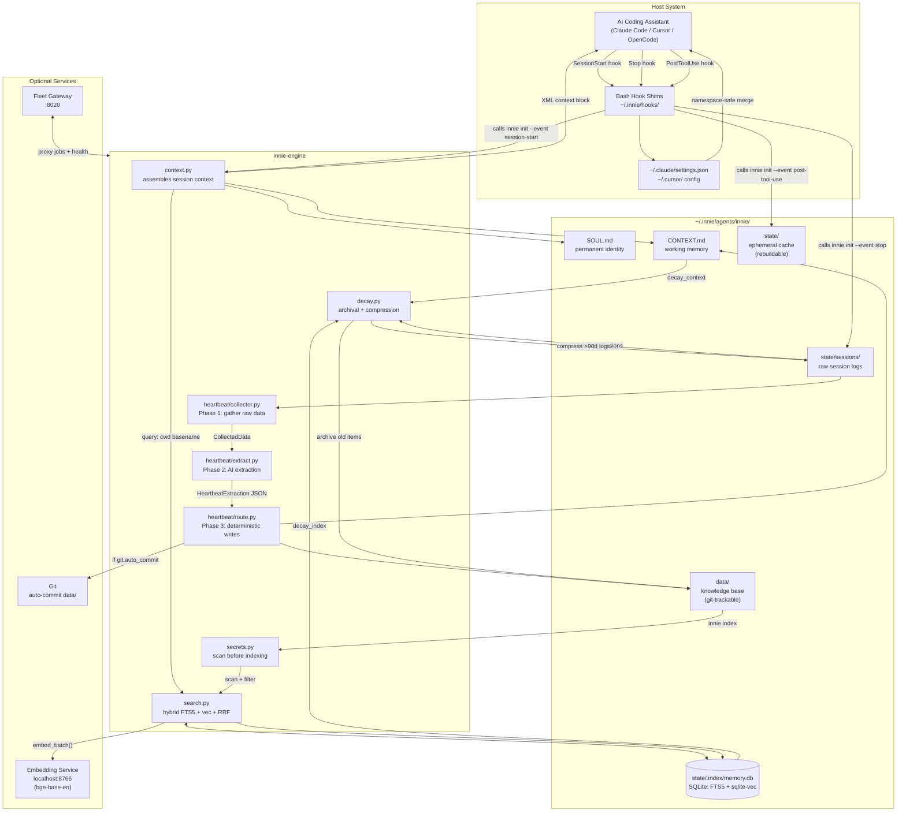
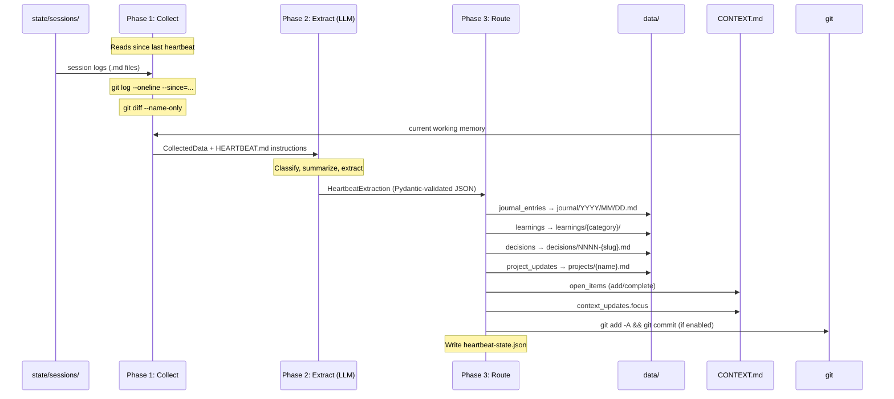
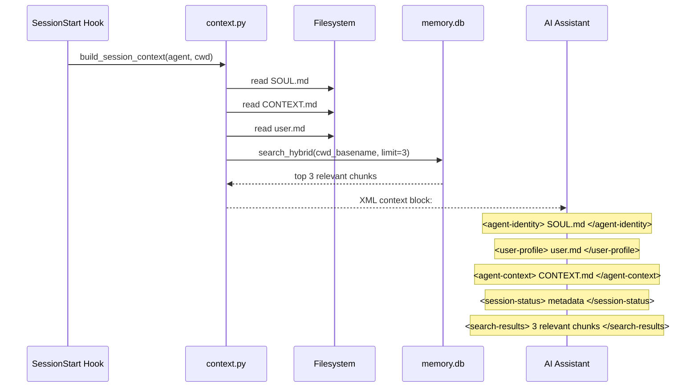
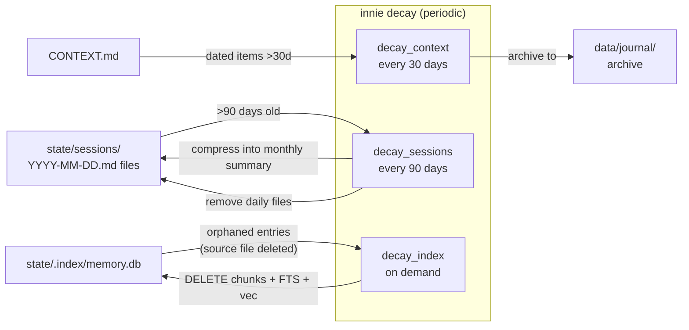

# Data Flow Diagram

## Complete System Data Flow

```mermaid
flowchart TD
    subgraph HOST["Host System"]
        AI["AI Coding Assistant\n(Claude Code / Cursor / OpenCode)"]
        HOOKS["Bash Hook Shims\n~/.innie/hooks/"]
        BACKEND["~/.claude/settings.json\n~/.cursor/ config"]
    end

    subgraph INNIE["innie-engine"]
        CTX["context.py\nassembles session context"]
        SEARCH["search.py\nhybrid FTS5 + vec + RRF"]
        HB_COLLECT["heartbeat/collector.py\nPhase 1: gather raw data"]
        HB_EXTRACT["heartbeat/extract.py\nPhase 2: AI extraction"]
        HB_ROUTE["heartbeat/route.py\nPhase 3: deterministic writes"]
        DECAY["decay.py\narchival + compression"]
        SECRETS["secrets.py\nscan before indexing"]
    end

    subgraph STORAGE["~/.innie/agents/innie/"]
        SOUL["SOUL.md\npermanent identity"]
        CONTEXT["CONTEXT.md\nworking memory"]
        DATA["data/\nknowledge base\n(git-trackable)"]
        STATE["state/\nephemeral cache\n(rebuildable)"]
        DB[("state/.index/memory.db\nSQLite: FTS5 + sqlite-vec")]
        SESSIONS["state/sessions/\nraw session logs"]
    end

    subgraph SERVICES["Optional Services"]
        EMBED["Embedding Service\nlocalhost:8766\n(bge-base-en)"]
        GIT["Git\nauto-commit data/"]
        FLEET["Fleet Gateway\n:8020"]
    end

    %% Session start flow
    AI -->|"SessionStart hook"| HOOKS
    HOOKS -->|"calls innie init --event session-start"| CTX
    CTX --> SOUL
    CTX --> CONTEXT
    CTX -->|"query: cwd basename"| SEARCH
    SEARCH <--> DB
    CTX -->|"XML context block"| AI

    %% Session end flow
    AI -->|"Stop hook"| HOOKS
    HOOKS -->|"calls innie init --event stop"| SESSIONS

    %% Tool trace flow
    AI -->|"PostToolUse hook"| HOOKS
    HOOKS -->|"calls innie init --event post-tool-use"| STATE

    %% Heartbeat flow
    SESSIONS --> HB_COLLECT
    HB_COLLECT -->|"CollectedData"| HB_EXTRACT
    HB_EXTRACT -->|"HeartbeatExtraction JSON"| HB_ROUTE
    HB_ROUTE --> DATA
    HB_ROUTE --> CONTEXT
    HB_ROUTE -->|"if git.auto_commit"| GIT

    %% Indexing flow
    DATA -->|"innie index"| SECRETS
    SECRETS -->|"scan + filter"| SEARCH
    SEARCH -->|"embed_batch()"| EMBED
    SEARCH --> DB

    %% Decay flow
    CONTEXT -->|"decay_context"| DECAY
    DECAY -->|"archive old items"| DATA
    SESSIONS -->|"decay_sessions"| DECAY
    DECAY -->|"compress >90d logs"| SESSIONS
    DB -->|"decay_index"| DECAY

    %% Backend installation
    HOOKS --> BACKEND
    BACKEND -->|"namespace-safe merge"| AI

    %% Fleet
    FLEET <-->|"proxy jobs + health"| INNIE
```

---

## Heartbeat Pipeline Detail

```mermaid
sequenceDiagram
    participant SESS as state/sessions/
    participant COL as Phase 1: Collect
    participant LLM as Phase 2: Extract (LLM)
    participant RT as Phase 3: Route
    participant DATA as data/
    participant CTX as CONTEXT.md
    participant GIT as git

    Note over COL: Reads since last heartbeat
    SESS ->> COL: session logs (.md files)
    Note over COL: git log --oneline --since=...
    Note over COL: git diff --name-only
    CTX ->> COL: current working memory

    COL ->> LLM: CollectedData + HEARTBEAT.md instructions
    Note over LLM: Classify, summarize, extract
    LLM ->> RT: HeartbeatExtraction (Pydantic-validated JSON)

    RT ->> DATA: journal_entries → journal/YYYY/MM/DD.md
    RT ->> DATA: learnings → learnings/{category}/
    RT ->> DATA: decisions → decisions/NNNN-{slug}.md
    RT ->> DATA: project_updates → projects/{name}.md
    RT ->> CTX: open_items (add/complete)
    RT ->> CTX: context_updates.focus
    RT ->> GIT: git add -A && git commit (if enabled)
    Note over RT: Write heartbeat-state.json
```

---

## Context Assembly at Session Start

```mermaid
sequenceDiagram
    participant HOOK as SessionStart Hook
    participant CTX as context.py
    participant FS as Filesystem
    participant DB as memory.db
    participant AI as AI Assistant

    HOOK ->> CTX: build_session_context(agent, cwd)
    CTX ->> FS: read SOUL.md
    CTX ->> FS: read CONTEXT.md
    CTX ->> FS: read user.md
    CTX ->> DB: search_hybrid(cwd_basename, limit=3)
    DB -->> CTX: top 3 relevant chunks
    CTX -->> AI: XML context block:
    Note over AI: <agent-identity> SOUL.md </agent-identity>
    Note over AI: <user-profile> user.md </user-profile>
    Note over AI: <agent-context> CONTEXT.md </agent-context>
    Note over AI: <session-status> metadata </session-status>
    Note over AI: <search-results> 3 relevant chunks </search-results>
```

---

## Decay Data Flow

```mermaid
flowchart LR
    CTX["CONTEXT.md"]
    SESS["state/sessions/\nYYYY-MM-DD.md files"]
    DB["state/.index/memory.db"]
    DATA["data/journal/\narchive"]

    subgraph DECAY["innie decay (periodic)"]
        DC["decay_context\nevery 30 days"]
        DS["decay_sessions\nevery 90 days"]
        DI["decay_index\non demand"]
    end

    CTX -->|"dated items >30d"| DC
    DC -->|"archive to"| DATA

    SESS -->|">90 days old"| DS
    DS -->|"compress into monthly summary"| SESS
    DS -->|"remove daily files"| SESS

    DB -->|"orphaned entries\n(source file deleted)"| DI
    DI -->|"DELETE chunks + FTS + vec"| DB
```
