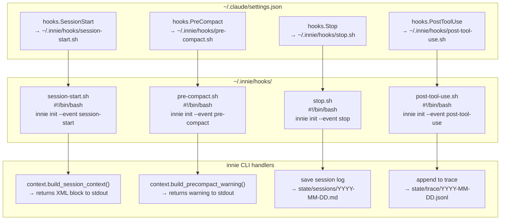

# Host Integration Diagram

What touches the host system, where it lives, and how it's controlled.

---

## Host Filesystem Map

```
Host Filesystem
│
├── ~/.innie/                               ← ALL innie data (isolated)
│   ├── config.toml                         ← global config
│   ├── user.md                             ← your profile
│   ├── fleet.yaml                          ← fleet config (optional)
│   ├── hooks/                              ← bash shim scripts
│   │   ├── session-start.sh               ← installed by innie backend install
│   │   ├── pre-compact.sh
│   │   ├── stop.sh
│   │   └── post-tool-use.sh
│   └── agents/
│       └── innie/                          ← isolated agent data
│           └── (see Storage Layout)
│
├── ~/.claude/settings.json                 ← MODIFIED (namespace-safe)
│   └── hooks → points to ~/.innie/hooks/  ← ONLY innie's own hooks added
│
├── ~/.cursor/ (settings files)             ← MODIFIED (namespace-safe, if cursor)
│
├── ~/.zshrc or ~/.bashrc                   ← APPENDED (only if innie alias is run)
│   └── alias innie="..."                  ← opt-in only
│
└── crontab                                 ← NOT modified (user sets up manually)
```

---

## Backend Hook Wiring



---

## Isolation Boundaries

```
┌──────────────────────────────────────────────────────────────┐
│                        HOST SYSTEM                            │
│                                                              │
│  AI Tool Config (r/w, namespace-safe)                        │
│  └── ~/.claude/settings.json                                 │
│  └── ~/.cursor/ settings                                     │
│                                                              │
│  ┌────────────────────────────────────────────────────────┐  │
│  │              INNIE-ENGINE ISOLATION BOUNDARY           │  │
│  │                                                        │  │
│  │  ~/.innie/                                             │  │
│  │  ├── config.toml           (innie reads/writes)        │  │
│  │  ├── hooks/                (innie owns, tool executes) │  │
│  │  └── agents/               (innie reads/writes)        │  │
│  │      └── <name>/                                       │  │
│  │          ├── data/         ← git-trackable, permanent  │  │
│  │          └── state/        ← ephemeral, rebuildable    │  │
│  │                                                        │  │
│  └────────────────────────────────────────────────────────┘  │
│                                                              │
│  Git (user's repos)                                          │
│  └── read-only: git log, git diff  (heartbeat collect)       │
│  └── write: ~/.innie/agents/*/data/  (only with auto_commit) │
│                                                              │
└──────────────────────────────────────────────────────────────┘
```

---

## Network Surface

```
                              Internet
                                 │
                    (if auto_push = true)
                                 │
                              ┌──┴──┐
                              │ Git │  (e.g., GitHub / Gitea)
                              └─────┘

                              Tailscale / LAN
                                 │
                    ┌────────────┴────────────┐
                    │                         │
            ┌───────┴──────┐        ┌─────────┴──────┐
            │ innie serve  │        │ innie fleet    │
            │   :8013      │        │   :8020        │
            │ Jobs API     │        │ Fleet gateway  │
            │ Memory API   │        │ (aggregates)   │
            └──────────────┘        └────────────────┘
                    │
                    ▼
              localhost:8766
           Embedding Service
           (Docker, bge-base-en)
```

**Default: innie has NO network surface.** `innie serve` and `innie fleet start` are opt-in.

---

## What Gets Backed Up to Git

When `git.auto_commit = true`:

```
Committed to git (data/)                    NOT committed (state/)
─────────────────────────────────────────  ─────────────────────────
data/journal/YYYY/MM/DD.md                 state/sessions/*.md
data/learnings/**/*.md                     state/trace/*.jsonl
data/meetings/*.md                         state/.index/memory.db
data/people/*.md                           state/heartbeat-state.json
data/decisions/*.md
data/projects/*.md
data/inbox/inbox.md
SOUL.md
CONTEXT.md
profile.yaml
HEARTBEAT.md
```

The `.gitignore` in the agent's data directory excludes `state/` explicitly.

---

## Uninstall Footprint

Running `innie backend uninstall` leaves the system in this state:

| Location | After uninstall |
|---|---|
| `~/.innie/` | Untouched (your data) |
| `~/.claude/settings.json` | innie hooks removed, user hooks preserved |
| `~/.zshrc` | alias line removed (if `innie alias` was run) |
| Crontab | Not modified (user added manually) |

Complete removal: `rm -rf ~/.innie` after uninstalling hooks.
